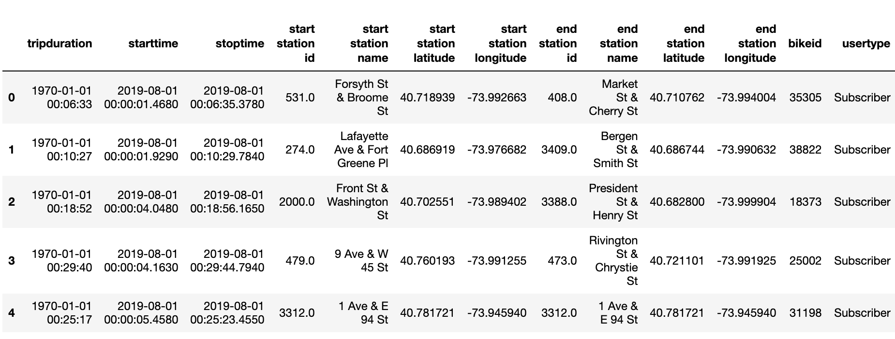
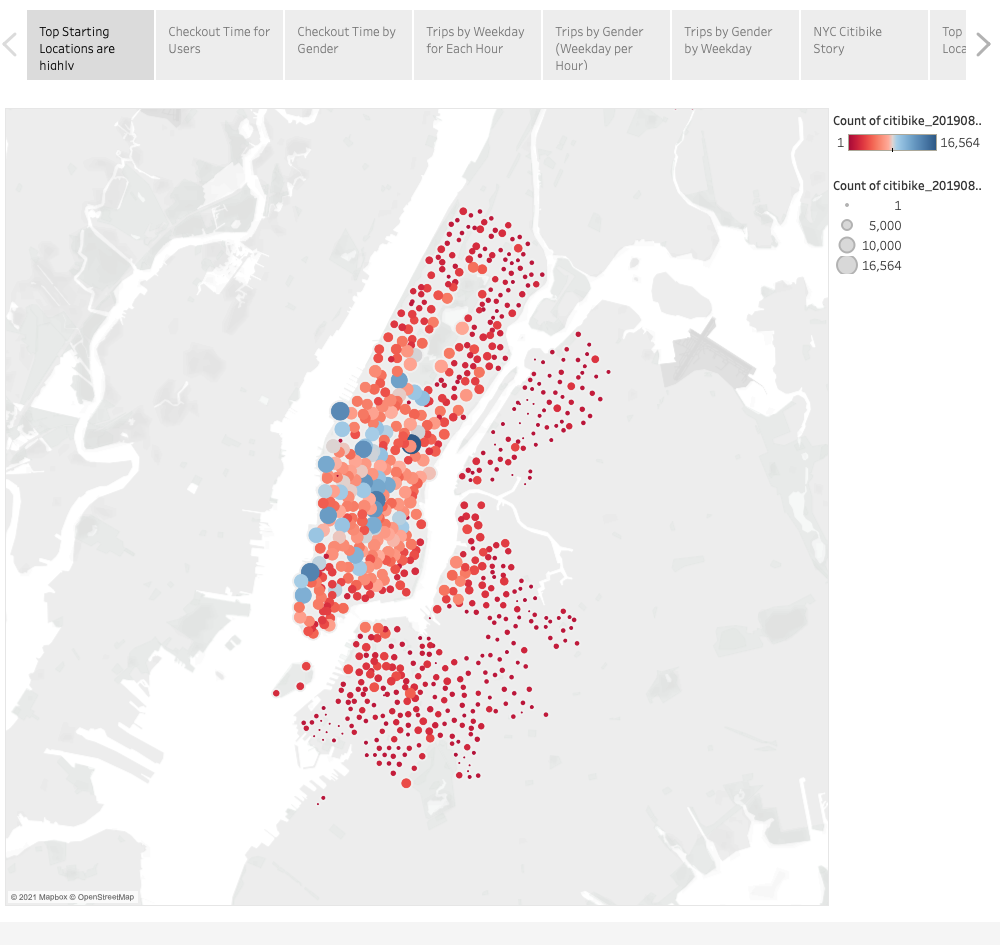
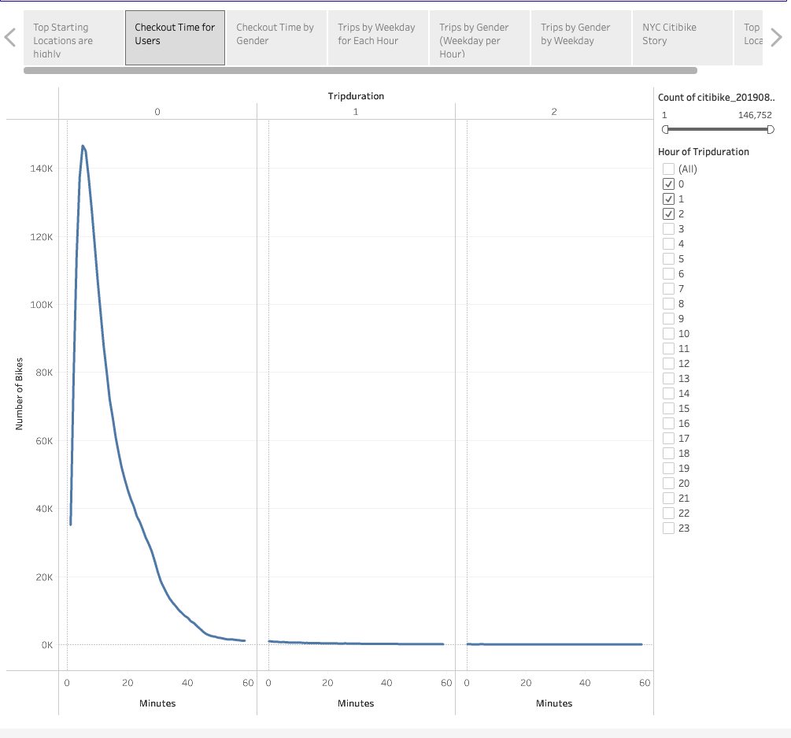
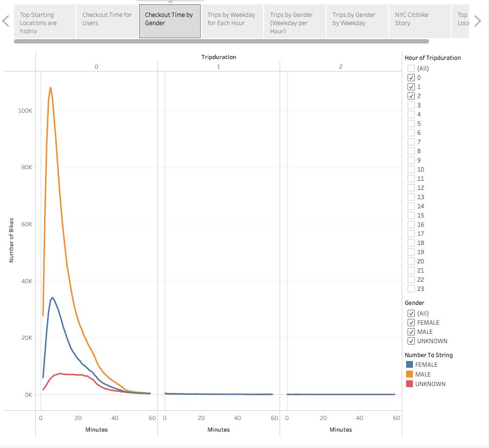
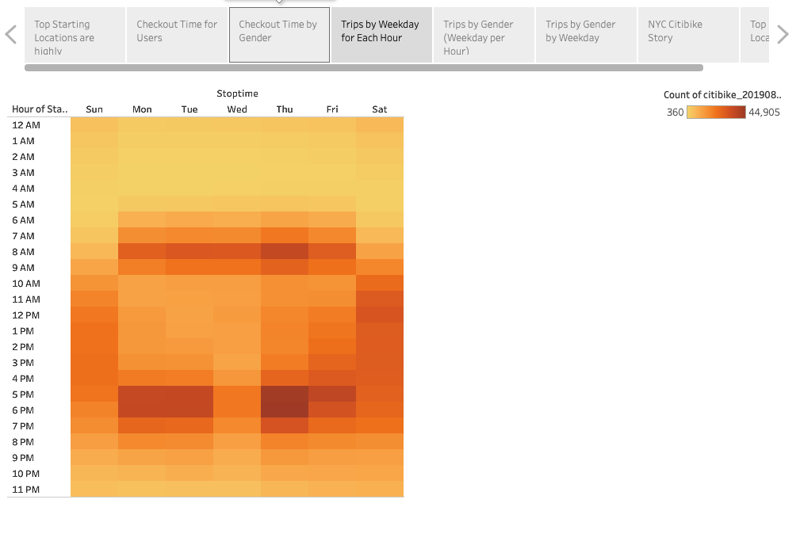
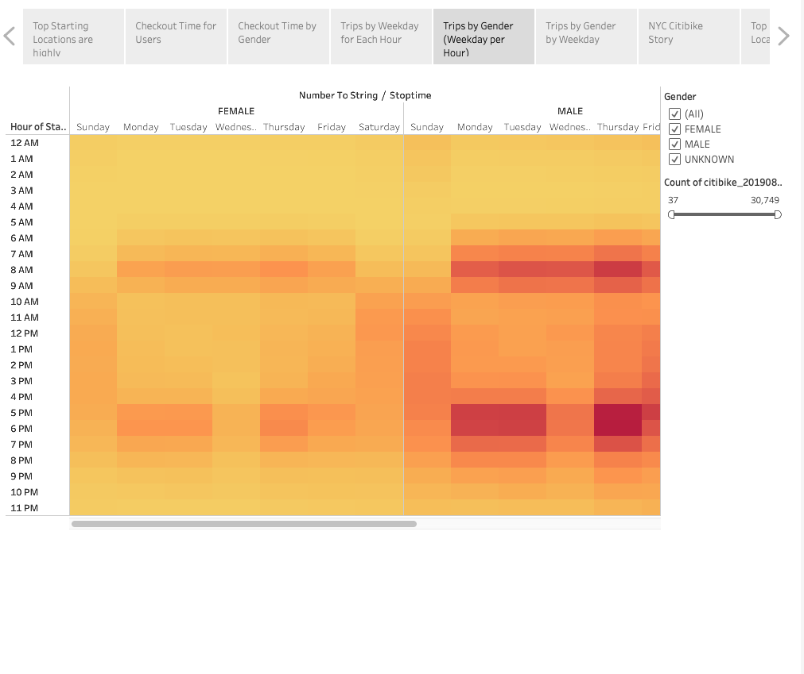
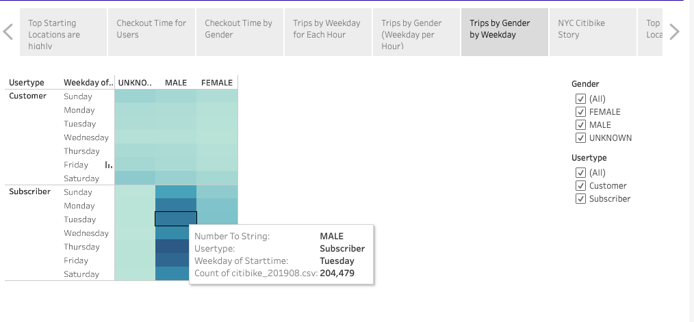
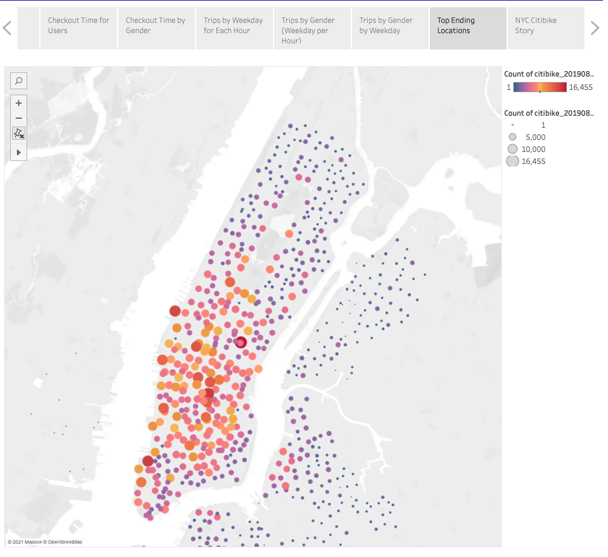

# Bikesharing
- NYC Citi Bike data analysis was carried out for the month of August 2019 and created a Tableau story based on starting a bike sharing company in Des Moines, Iowa.

### Overview of the statistical analysis:
- The purpose of the project was to use data from New York City's Citi Bike program and see if it would be possible to recreate the program in De Moines, Iowa.
- In order to complete this analysis, I used Python's pandas library to clean up the data and then created visualizations of that data using Tableau.

### Data Citation:
- File 201908-citibike-tripdata.csv was downloaded from the [Citi Bike System Data](https://www.citibikenyc.com/system-data) site.
- Using Python and Pandas functions, the "tripduration" column was converted from an integer to a datetime datatype to get the time in hours, minutes, and seconds (00:00:00)
- 

### Results:
### Throughout this analysis I wanted to answer the following questions:

1. What Are the Top Bike Stations in the City for Starting a Journey?
2. When are users using the bikes?
3. What is the length of time that bikes are checked out for each gender?
4. What are the number of bike trips by weekday for each hour of the day as a heatmap?
5. What are the number of bike trips by gender for each hour of each day of the week as a heatmap?
6. What are the number of bike trips for each type of user and gender for each day of the week?
7. What Are the Top Bike Stations for Ending a Journey?

### To answer these questions I came up with the following visualizations:
- What Are the Top Bike Stations in the City for Starting a Journey?
Top Starting Locations are highly concentrated around the most populous areas (Mid and Lower Manhattan).

- When are users using the bikes?
Riders are interested in shorter rides.

- What is the length of time that bikes are checked out for each gender?
Checkout Time by Gender - Men make up most of the user population.

- What are the number of bike trips by weekday for each hour of the day as a heatmap?
Trips by Weekday for Each Hour - Weekday rider traffic peaks at traditional commuting times while weekends are at gradual use throughout the day.

- What are the number of bike trips by gender for each hour of each day of the week as a heatmap?
Trips by Gender (Weekday per Hour) - Males and females have the same high traffic times throughout the week.

-  What are the number of bike trips for each type of user and gender for each day of the week?
Trips by Gender by Weekday - The most common usertype are male subscribers with Thursdays being their most frequently used day of the week.

- What Are the Top Bike Stations in the City for Ending a Journey?
Top Ending Locations - Due to shorter rides top ending locations are also concentrated around the most populous areas( Mid and lower Manhattan)

### Summary:
Based on the findings above, these are the top takeaways to create a successful citibike program in Des Moines.
1. Advertising should target men as they are the main user demographic.
2. Bikes should be positioned in the most populous areas.
3. Offer incentives to push for daily use throughout the week during traditional commuting hours.

### For a more in depth and interactive view of this analysis, checkout the Tableau link below:
🔗Link to [Tableau NYC Citibike Story](https://public.tableau.com/profile/pasmina#!/vizhome/NYC_Citibike_Challenge_16212333844800/NYCCitibikeStory?publish=yes)
